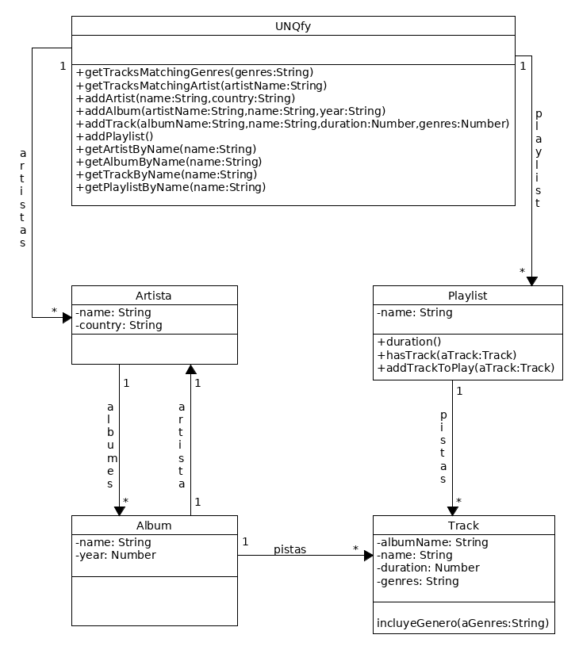

# Visado1-Dasilva-Bada

  

## Paso A Paso los comandos a ingresar 
### node main.js addArtist "Pepe" "Uruguay"
### node main.js addArtist "Carlos Gardel" "Uruguay"
### node main.js addAlbum "Pepe" "Feliz" "1999"
### node main.js addAlbum "Pepe" "Soledad" "1998"
### node main.js addAlbum "Carlos Gardel" "Buenos Tangos Pop" "1998"
### node main.js addTrack "Mambo" "Feliz" "3.12" "Pop"
### node main.js addTrack "Sabroso" "Feliz" "3.12" "Pop"
### node main.js addTrack "Golazo De Penal" "Soledad" "3.12" "Rock"
### node main.js addTrack "Bailando" "Feliz" "4.12" "Pop"
### node main.js addTrack "Tranquilo" "Feliz" "3.12" "Pop"
### node main.js addTrack "Tanguero Nocturno" "Buenos Tangos Pop" "3.42" "Pop"
### node main.js addPlaylist "ListaPop" "Pop" "6"
### node main.js getPlaylistByName "ListaPop"
### node main.js addPlaylist "ListaPop2" "Pop" "6"
### node main.js getPlaylistByName "ListaPop2"
### node main.js addPlaylist "ListaPop3" "Pop" "9"
### node main.js getPlaylistByName "ListaPop3"
### node main.js getTracksMatchingGenres "Pop"
### node main.js getTracksMatchingArtist "Pepe"
### node main.js getArtistByName "Pepe"
### node main.js getAlbumByName "Feliz"
### node main.js getTrackByName "Sabroso"

  
